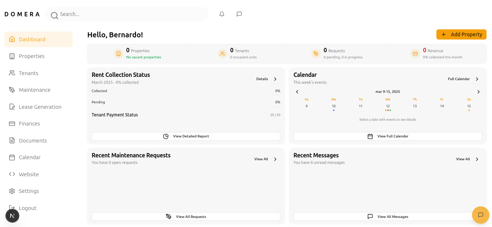

# 🏠 Domera - Rental Property Management Platform

Domera is a comprehensive full-stack landlord dashboard designed to streamline rental property management. The platform features AI-powered lease agreement generation, property marketing tools, maintenance tracking, and financial analytics - all in one modern interface.

## ✨ Features

- **🤖 AI-Powered Lease Generation** - Create legally compliant rental agreements with clause analysis against state-specific laws
- **🌐 Website & Blog Builder** - Built-in landing pages and blogs for property marketing
- **🔧 Maintenance Management** - Track issues and connect with vendors
- **📊 Financial Analytics** - Monitor rental income, expenses, and property performance
- **👥 Tenant Portal** - Streamline communication and document sharing
- **🎨 Customizable Themes** - Personalize your dashboard experience
- **📱 Responsive Design** - Works seamlessly on desktop and mobile

## 🛠 Tech Stack

**Frontend:**
- Next.js 14+ with TypeScript
- Tailwind CSS for styling
- React Hook Form for form management

**Backend & Database:**
- **Supabase** - PostgreSQL database, authentication, and real-time subscriptions
- **Supabase Storage** - File storage (images, documents, static files)

**AI & Machine Learning:**
- **LangChain.js** - AI orchestration and chain management
- **OpenAI API** - Natural language processing
- **LangSmith** - AI tracing and monitoring




## 🚀 Quick Start

### Prerequisites
- Node.js 18+ 
- npm or yarn
- Supabase account
- OpenAI API account

### Installation

1. **Clone the repository**
```bash
https://github.com/BernardoOdreman/Domera-rental-management.git
cd domera
npm install

